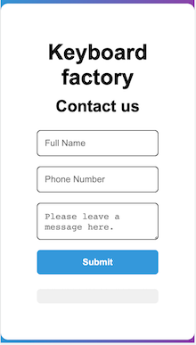

# Barcode Generated Form

## On Computer

## On Phone

## Overview

Barcode Generated Form is a simple and efficient tool that allows users to create a personalized barcode.
When someone scans the generated barcode using their phone's barcode scanner app, it will open a contact form for your shop, enabling people to contact you directly. Whether it's for out-of-hours inquiries, general information, or any other reason, this project aims to streamline communication between your shop and potential customers.

## Features

- Easily create custom barcodes that lead to your shop's contact form.
- Seamless integration with barcode scanner apps on smartphones.
- Convenient way for customers to contact your shop directly.
- Improve customer engagement and enhance communication.

## Getting Started

To set up the Barcode Generated Form, follow these steps:

1. Fork this repository by clicking the "Fork" button in the top right corner of this page.
2. Clone the forked repository to your local machine: `git clone https://github.com/prgrmr-yn/barcode-generated-form.git`
3. Navigate to the project directory: `cd barcode-generated-form`
4. Open the `index.html` file in a text editor.
5. Customize the contact form fields with your shop's information.
6. Save the changes and launch the project locally in your browser.
7. You will need to create discord account and make a small group for you to create webhooks.
8. Webhooks will be used to receive information for the forms.

## Usage

1. Customize the contact form fields in the `index.html` file with your shop's relevant information, such as email address, phone number, or any other details you wish to collect from potential customers.
2. Save the changes and push them to your forked GitHub repository.
3. Deploy the project to a web server or use GitHub Pages to host it publicly.
4. Print and display the generated barcode in strategic locations in your shop or on promotional materials.
5. Encourage customers to scan the barcode using their phone's barcode scanner app to open the contact form and get in touch with your shop.

## Support and Contributions

If you encounter any issues or have suggestions for improvement, feel free to create an issue or pull request in this repository. Your feedback and contributions are highly appreciated!

## Disclaimer

This project is provided as-is, without any warranty or guarantees. The developers of this project are not liable for any misuse, damages, or consequences that may arise from the use of this project.
